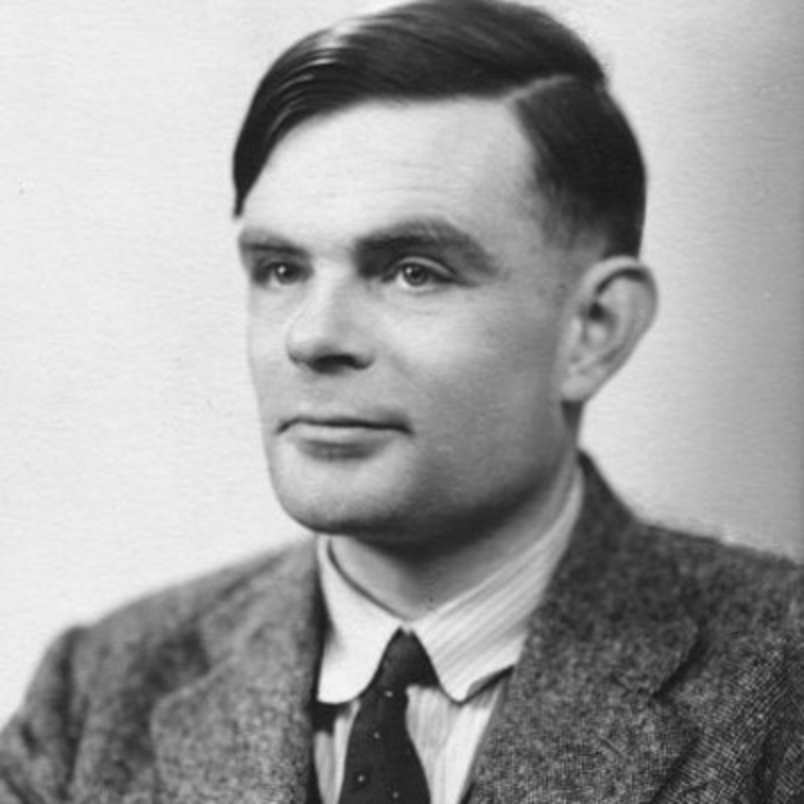
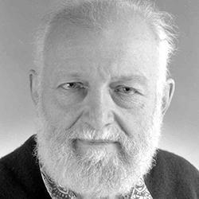
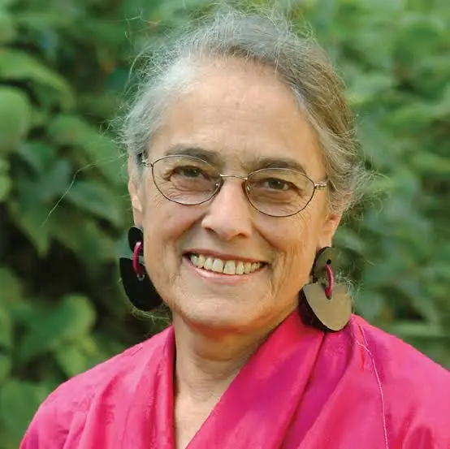

## Communicating Nonlinear Dynamics Across Boundaries via Interactive Simulations

 

**Andrew Krause (@Blindmath)**

---

### Join this presentation

:::  columns

:::  column
{width=65%}

[**andrewlkrause.github.io**](https://andrewlkrause.github.io){target="_blank"}
:::

::: column
{width=65%}

[**VisualPDE.com**](https://visualpde.com){target="_blank"}
:::

:::

***Navigation:*** <kbd>f</kbd> fullscreen; <kbd>esc</kbd> slide deck; <kbd>→</kbd>/<kbd>←</kbd> (swiping mobile) move slides; <kbd>h</kbd> help.

---

### Modelling is about communicating ideas

::: {.swap-frame}

::: {.fragment .fade-in-then-out}
::: {.columns}
::: {.column width="90%}

"This model will be a simplification and an idealization, and consequently a falsification. It is to be hoped that the features retained ***for discussion*** are those of greatest importance in the present state of knowledge." --Alan Turing

:::
::: {.column width="40%"}
{width=100%}
:::
:::
:::

::: {.fragment .fade-in-then-out}
::: {.columns}
::: {.column width="80%}

"[We] treat the same problem with several alternative models each with different simplifications... if these models, despite their different assumptions, lead to similar results we have a robust theorem which is relatively free of the details of the model. Hence ***our truth is the intersection of independent lies.***" --Richard Levins
:::
::: {.column width="20%"}
{width=100%}
:::
:::
:::

::: {.fragment .fade-in-then-out}
::: {.columns}
::: {.column width="90%}

"...although all scientists share a common ambition for knowledge, it does not follow that ***what counts as knowledge is commonly agreed upon***. The history of science reveals a wide diversity of questions asked, explanations sought, and methodologies employed..." --Evelyn Fox Keller
:::
::: {.column width="40%"}
{width=100%}
:::
:::
:::

::: {.fragment .fade-in-then-out}
::: {.columns}
::: {.column width="90%}

"...this diversity is in turn reflected in the kinds of knowledge acquired, and indeed in ***what counts as knowledge***. To a large degree, both the ***kinds of questions one asks and the explanations that one finds satisfying*** depend on one's *a priori* relation to the objects of study." --Evelyn Fox Keller
:::
::: {.column width="40%"}
{width=100%}
:::
:::
:::
:::

---

### Gray(t)-Scott! VisualPDE in a slide

::: {.small}
$$
\begin{aligned}
\frac{\partial u}{\partial t} &= D_u\nabla^2 u + f(u, v) = \nabla^2 u + u^2 v - (a+b) u , \\
\frac{\partial v}{\partial t} &= D_v \nabla^2 v + g(u, v) = 2 \nabla^2 v-u^2 v + a (1 - v)
\end{aligned}
$$
:::

<iframe class="visualpde-embed" title="VisualPDE simulation" src="https://visualpde.com/sim?options=N4IgxiBcIG4JYCc4BM4GcQBoTIKq6hAEYscA1MwgJlOQHU7CAGWjaIpz0sA6F7MJXakA1oQCGAXiYA6JgGYA7AAI4AO2UBtJpllEAugG4ARtLkA2VRu1yALLpkHDpALbjmMpa7jNSAB0IAYQBXNAAXAHsXfwQI4wBTADFgtUJgmLj4gBl4tQBzMIALKHlOHRAEXhBggD0qACoYZQBaZQAKcQBqYwBKevTsBCEQZtqGps7lcXq2ohblGB7SBEY+UjQA6Hl11OhghdIYKE1QcQRYgHdAiIAbCOCEKHMAVmf5Z+wzy4ARXLQ4MIATygsg+IC+EQuOXyRQAsuIAB6EEifc6QgDKYHEN3iEmCkVIEIuAA1CFkAPoIgD0VHmSNRlwAmmTyYCafNgZ98RF0fEwtc7g8AErifK4yAAM2xaHiAnELniCHEABVCnz3JBSnKFUqAAqFHya8pYnXiABaESiIJkAA4BLd7gg3JtYIgUOhuA6HsYzlApTcZfa1JEHmx-YHwBFg46BY6QUGQwgAKJ+f53XayJhEBOOgBywWikDBYFCkRc6IeUrA4vDspA8RcxgiaDD0rrDabLYAgo24LkwtawR3m2hvnAJRLQuLZOZsMOW-rDUQZM9FEw7fXGyP0Qa1MDIBw51uW+iXJaimp4i3rVQj520Oi-PESzdfZBZLfN-fVerrYobc89ggBKNxwH4T7ILGDzOn6bbYKBl50CgcLBDcUDZiAbgIlBQzYsE4ogLIXjYC46g4WQeEEfwIARDAiqvvutbYLR9HiICOHxjRdEIAxKZplG1qcGCLE8WxSYIn4jzCMx3EMVk6jxEhyAoWhB7YH4dxhMqgJPoQGmiri6mxMY6h5LBAZ1pJmTJLs1QZAk0IFMURqcEZmTabp0DqGE8R5EqaFuQkpJrIF8TMiFIBoJW4jVjZvjYEUCDxPE3wABLxHAeSFGEmLYtOMiKNgdFgJECCJH2NzIOZEYXIU4haREuqaWkpBqPKBEkAAvvo2AXFVeykBcLoDJFcAuMqAI4oQADiSqAoAyASYhEYQDp1QA" frameborder="0"></iframe>

---

## Slide 3

> More to add...

---