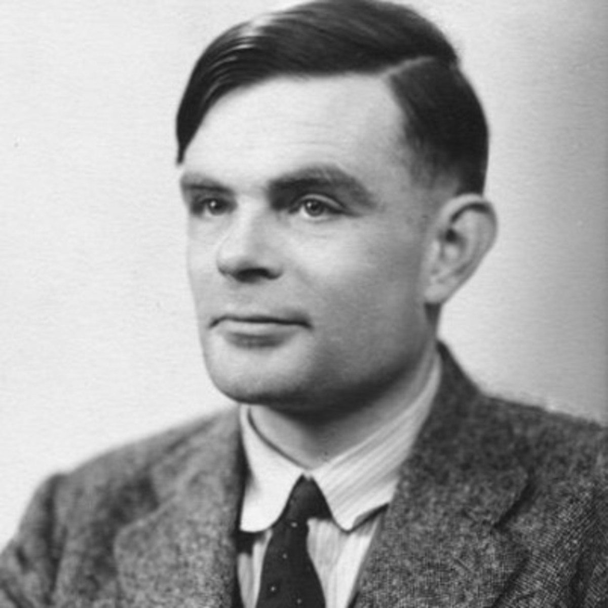
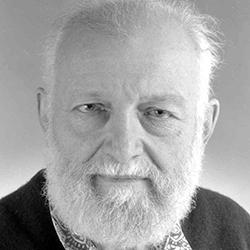
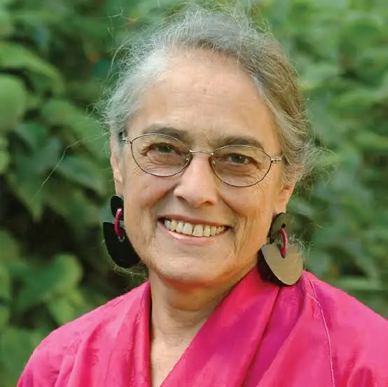
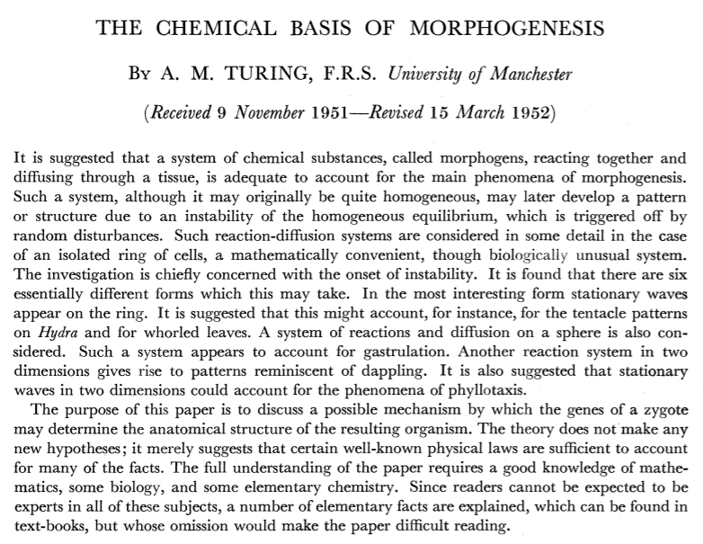
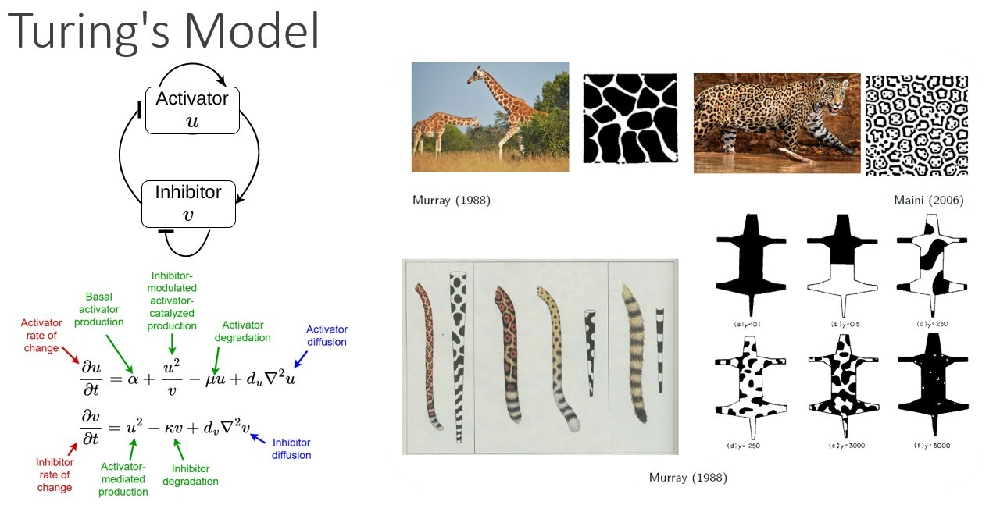
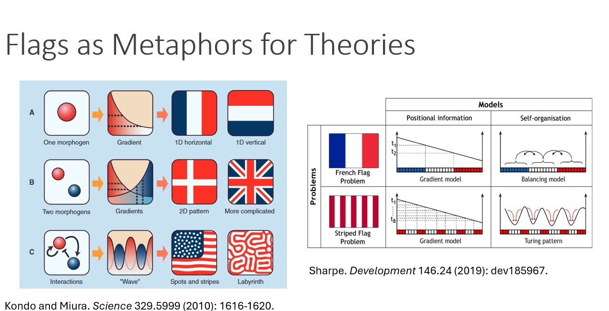

## Communicating Nonlinear Dynamics Across Boundaries via Interactive Simulations

 

**Andrew Krause (@Blindmath)**

---

### Join this presentation

:::  columns

:::  column
{width=65%}

[**andrewlkrause.github.io**](https://andrewlkrause.github.io){target="_blank"}
:::

::: column
{width=65%}

[**VisualPDE.com**](https://visualpde.com){target="_blank"}
:::

:::

***Navigation:*** <kbd>f</kbd> fullscreen; <kbd>esc</kbd> slide deck; <kbd>→</kbd>/<kbd>←</kbd> (swiping mobile) move slides.

---

### Thoughts on modeling and simulation

::: {.swap-frame}

::: {.fragment .fade-in-then-out}
::: {.columns}
::: {.column width="90%}

"This model will be a simplification and an idealization, and consequently a falsification. It is to be hoped that the features retained ***for discussion*** are those of greatest importance in the present state of knowledge." --Alan Turing

:::
::: {.column width="40%"}
{width=100%}
:::
:::
:::

::: {.fragment .fade-in-then-out}
::: {.columns}
::: {.column width="80%}

"[We] treat the same problem with several alternative models each with different simplifications... if these models, despite their different assumptions, lead to similar results we have a robust theorem which is relatively free of the details of the model. Hence ***our truth is the intersection of independent lies.***" --Richard Levins
:::
::: {.column width="20%"}
{width=100%}
:::
:::
:::

::: {.fragment .fade-in-then-out}
::: {.columns}
::: {.column width="90%}

"...although all scientists share a common ambition for knowledge, it does not follow that ***what counts as knowledge is commonly agreed upon***. The history of science reveals a wide diversity of questions asked, explanations sought, and methodologies employed..." --Evelyn Fox Keller
:::
::: {.column width="40%"}
{width=100%}
:::
:::
:::

::: {.fragment .fade-in-then-out}
::: {.columns}
::: {.column width="90%}

"...this diversity is in turn reflected in the kinds of knowledge acquired, and indeed in ***what counts as knowledge***. To a large degree, both the ***kinds of questions one asks and the explanations that one finds satisfying*** depend on one's *a priori* relation to the objects of study." --Evelyn Fox Keller
:::
::: {.column width="40%"}
{width=100%}
:::
:::
:::

::: {.fragment}

:::

::: {.fragment}
"*for discussion*" 

"*our truth is the intersection of independent lies.*" 

"*what counts as knowledge is commonly agreed upon*" 

"*questions one asks and the explanations that one finds satisfying*"
:::

:::

::: {.fragment}
**Communication is a central aspect of modelling!**
:::

::: {.fragment}
For more quotes, see [empathicdynamics.wordpress.com/2019/07/25/quotes-about-mathematical-modelling/](https://empathicdynamics.wordpress.com/2019/07/25/quotes-about-mathematical-modelling/).
:::

---

### The origin of chemical pattern formation

---

###

--- 

###

--- 

### Gray(t)-Scott! VisualPDE in a slide

::: {.small}
$$
\begin{aligned}
\frac{\partial u}{\partial t} &= D_u\nabla^2 u + f(u, v) = \nabla^2 u + u^2 v - (a+b) u , \\
\frac{\partial v}{\partial t} &= D_v \nabla^2 v + g(u, v) = 2 \nabla^2 v-u^2 v + a (1 - v)
\end{aligned}
$$
:::

<iframe class="visualpde-embed" title="Gray Scott" src="https://visualpde.com/sim?options=N4IgxiBcIG4JYCc4BM4GcQBoTIKq6hAEYscA1MwgJlOQHU7CAGWjaIpz0sA6F7MJXakA1oQCGAXiYA6JgGYA7AAI4AO2UBtJpllEAugG4ARtLkA2VRu1yALLpkHDpALbjmMpa7jNSAB0IAYQBXNAAXAHsXfwQI4wBTADFgtUJgmLj4gBl4tQBzMIALKHlOHRAEXhBggD0qACoYZQBaZQAKcQBqYwBKevTsBCEQZtqGps7lcXq2ohblGB7SBEY+UjQA6Hl11OhghdIYKE1QcQRYgHdAiIAbCOCEKHMAVmf5Z+wzy4ARXLQ4MIATygsg+IC+EQuOXyRQAsuIAB6EEifc6QgDKYHEN3iEmCkVIEIuAA1CFkAPoIgD0VHmSNRlwAmmTyYCafNgZ98RF0fEwtc7g8AErifK4yAAM2xaHiAnELniCHEABVCnz3JBSnKFUqAAqFHya8pYnXiABaESiIJkAA4BLd7gg3JtYIgUOhuA6HsYzlApTcZfa1JEHmx-YHwBFg46BY6QUGQwgAKJ+f53XayJhEBOOgBywWikDBYFCkRc6IeUrA4vDspA8RcxgiaDD0rrDabLYAgo24LkwtawR3m2hvnAJRLQuLZOZsMOW-rDUQZM9FEw7fXGyP0Qa1MDIBw51uW+iXJaimp4i3rVQj520Oi-PESzdfZBZLfN-fVerrYobc89ggBKNxwH4T7ILGDzOn6bbYKBl50CgcLBDcUDZiAbgIlBQzYsE4ogLIXjYC46g4WQeEEfwIARDAiqvvutbYLR9HiICOHxjRdEIAxKZplG1qcGCLE8WxSYIn4jzCMx3EMVk6jxEhyAoWhB7YH4dxhMqgJPoQGmiri6mxMY6h5LBAZ1pJmTJLs1QZAk0IFMURqcEZmTabp0DqGE8R5EqaFuQkpJrIF8TMiFIBoJW4jVjZvjYEUCDxPE3wABLxHAeSFGEmLYtOMiKNgdFgJECCJH2NzIOZEYXIU4haREuqaWkpBqPKBEkAAvvo2AXFVeykBcLoDJFcAuMqAI4oQADiSqAoAyASYhEYQDp1QA" frameborder="0"></iframe>

---

## Keller-Segel chemotaxis

<iframe class="visualpde-embed" title="Keller-Segel Chemotaxis" src="https://visualpde.com/sim?options=N4IgRgTiBcIKwDoBsAGN6MbiANOAbjCAEoCCAcgCK4gDG10ALhAK4CmeAJgKrdECMNHgDUiAWloAqFgHoAFPwDULAHoAmAJRDho2NS4B1A0RRDGMFAjRw8bGM3Z5afWEstrJZKjVq6Q-GQBDGgBrIloAAgBeCIAWCIBLADsIgG0AZhwIy34s2IBdAG5KaIj+RJTUlCz+IsDSnIq06uyENXyaAFtg2DUEbDxOhJMrNFiADjV+FDgUAE4AdhR02LnYpEE8AAciAGEWAGdGAHtOmi2IY7A2ADEWJKIWc8vrgBk2JIBzRgALGH5ZngIC4QCxJAoxCwtEC-CwxIFJIQgcZYKY8Acdqi2jQDg9YCwIkiQAcnkxWBwQIRoKlQIEIJcAO67Y4AG2OLCg0CQcDg6RsIDpjMoHwOCUYAE8LP08ILjgz3l9fgBZQIADwENFlDIAyrRAiy7LBAiwTpr6XKABpEV4AfVVMjUETEEXVMvNDIAmtabeKHU6IpKZSbjtq2IxmWyOcRAl9DQAzfUHCl6zpsCCBAAqPzDPXS1TogVT6YACj9htA805C2nAgAtY6nKXjJys9kQbqYkCMDlgY4+Vs9ukwBMspMtpInDkHYeJ5PHCdtiNtizjycQACiW1FbLxlhQuTo87X5BYZ2g-NohxOnW1HITtHjs9snV7B2nZMcIDYL+Ob9IL4SD5zGgSx+W-V8DkoBI4zjQ5DUsJBnwg0ty34folmbL8fzfbUyySSVoGmJDfwObVOgbX4kjYN8pTUYicK2NhLxZIcQLaeiDizHMpQWcY4FiPA4xZBItkYzglw5DsZ1HClhKogwEk4ZUWBZf5BjVCSIGEfV2CIPoBhAIYkk07SWV0rF0AmKYZnmJYVjWDYaGOfA0xYgiRzHEBnNcwJxU0lcvJciA3M3bd5ylaw8G84LfPXVULg1KKgrc15kjYBSlJ+JUVLUkAtjZRgM3FRiiHymM7G2F5kk+aTPIuK5bnuR5ngahVvj+QjATyl42CKkrYGSRg2E+dNVMqhqrVRFrri9Kb0TvQIHzuPEQDRLsfggNg2EoAAJNgEk+H5GF1fV4IQBY8Bc2gTggG5AJZThaopBkfkCQrjmLArmrwJJqw1ABffI8AZR78RoBlOyedEEk6DMxQNIgAGk2BZA0IEAZAJQ0+FGQH+oA" frameborder="0"></iframe>

---

## Cyclic competition

<iframe class="visualpde-embed" title="Cyclic Chemotaxis" src="https://canary.visualpde.com/sim?options=N4IgRgTiBcIIwAYQBoQGMYgJZoKYvQBEYAXCAV11QBMBVWzYm2gRUwFo0ALLAKnID0ACjgBqcgD0ATAEoC1AGoLG8qQFYO3PgDdhY7dLk0A6sZU0AzADZNPXgHc9o+4fks2sJiGpqNn+VY2-jQAzphqCEg0JDAIAHQIcKj40GSUqGgMsHDCAIaiYKJwMqLxcLwASgCCAHKENQRoytl5BUVG6GYtQvmFxY0eICKtfTIyAtSNfkM5PW3F45MZQTMj7YsEANaYuQAEuwC8+-EAHADcYPtHu3BxAJxn1FfHcXBnWoe78ZG7WAB2+wA2ghkDc4hYALpnQjPL5xc4EP4wKyoAAOmAAwuQQiQAPYAWwIqIguLAuAAYuQkbByESSWSADK4P4AcxIXBgcAiqAgWRA5F4InY5HYuV42nYYAcHQgzRA2kFcEl-HYErF9hlXRA9kVopVUolGoIEEG5F27F21F4aAA+rSedNtObLdabdpjSt7M6rbb7AQQrgSABlXC4SapChUEAhdHZf3U-m7J1e21m21O30Ed3QQGgXIQEn2DG4gA2uPIUGgVl8FjUqHzhcIzJCWBIAE9YnE6yAG7j7EzWeyALK5AAemDgBF79iDaFyJZSPfIeKnBb7AA1MAybaOBFJneP62v7ABNLc2tt750d+vL3EhkjFssViq5VkpABm84DGVy+NwEC5AAKlwga5DAFggugf4AbkAAKPAQVBc7-oBABauIEp2JwZKW5YQPiuSxtgeCNHhFZgPmMBfiWP7oLifx4hWYTQDRdFoAxTEQE++GxLhjH4QAoqiLZltS3xJPRAkVjU5CEtA3ZoNieL4kGFZfqRrHflGuD4mAuIhCxaQ6XpBkhFUelYMyMTQPE3a6fphmEFgH4ftiKTxCiIAOWZCFYJyXYAOwIDh3mmYZQY8H8HbQIgyThSEQb4ph7J-LghmdlI8WOYlqK4EpJZUbZcRZWFOUgWBnaBScagACyoB+JZYKieXUDxFaEbGbFRk1aXGFg1DDuQJacqghGju1srzpQE4JAQ+L-JNCjTYu3wELi2gAYVMXdagG1bbkbaTXxID7RA23CaJDGdpE3ZnRdo7EhO62bedh0Mv8uD9YNXBDsNo0gKiZYkEBbZ5ZgQNvvgaL0v8LLUdpMOkhSVKYPagP0rgA5shysXchjyOg+DsD-CQuAsoBI1I2Sm6wFEBNkmedP+upuR4JSCb0+yEChoQAASuBYCyXDBnOC5Vagm1oHiEDklZJbhrt2pcLkIO4nBwNo4iMHPQAvsgebHsdVY1t205Nn8Lbtp2ZvHtjw5js9R6FrO86Lrkd6roWtMgNuu77hah49seTO+xeV4WjeS54g+k2vu+CO0VGKGwRVJDgdAkG-qh8GIZnyEwehmHyacuHPgRRGYDg0P0eXlGVkrHHSRALGN5x+HG8h7cVpdWBiTdklN1xsnyYpykEmpEAaZ+iNlWZpCRtlZkWWAVmMTbS9OS5bkBp2Xk+YZfkBWowWhQfiVRTFcVzxFyW4ql6UsfEpXn0GeUFUVz+byEacZ-E1V1Qak1FqYZJqdUTnRXqX0BpDRGrFMaY4lorVmvTBafwkElhmnTOae1XrbQgVGe6h1O64IOm2Xu-diq3VIW9chj1KzwBemQj6fUYG-X+vAwGwMiaLkhmlOkpI4YEOpijBM6NiTI3trjLkUEJFkh4VXRi5NKYCJppgemcjcCh3piEVm7NUbM1QNzXmAshYi1duLYqgVJb5RlnLXACthHK1VkBdWmtYDulQH8HW0ApD60NoWY21Y1C1mdn2C2VsYp2TCf2ZkOMRzjjjDEix7tPYxJ9n7COuwg7TlDtuS8AddhRw9jHQMcc3wshnknbOqdQLpyQjUwCR986NNyBhLCxVQocXLuAkmpEy74Xrk4oe+FW6zxGRWEhUkuIUOulQwe3cIAjxgGPHEE89FVLoufBe6Qb7mUstZDeeznKuXcnvb+zTbgnxCt-SK-wr5QVfnfB+GViovwSm-fKw1P4lW-r-KqNV6ogEas1VqYDK5aWqSAKB31YEA3GhgrB8AcEgDQYi1aKKiE7VnliqZWLZniQSAgO6eDDqCXoU7U6pK2wsOgT9P6cDJJA3vgo2AfCa5yKEZCuimiOZaxEVIzk+NNGsuwEoim85VG4B9hozG2iWZTzZqI9RBBjG4H5oLYWos3YS3lLY3Est5aK1nvYFWasNb30wH6LxPiLC6whKgew4Z+QEHsMRdGLZ8RAVbJYkAGI2xoCamgXYHF8R5RIK2LA10aDb2xFGv4tAgxkHUUSyIiR5CxpbAxBQSaGHfDTbVDNpys1-GMLmlNabIgnCLTveNWR81psktQTN8bmgNoQEC5txb41dHbSFXWQA" frameborder="0"></iframe>

---